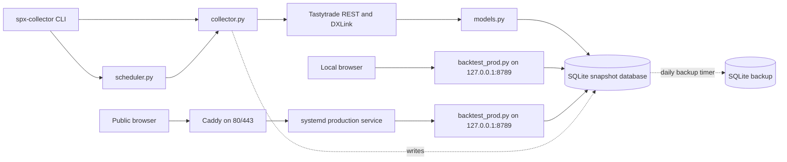

# Architecture

The project has one data collection path and one web app. The same web app runs
locally for review and on the production host.

## Data and request flow

### Collection

- `src/spx_collector/main.py` provides `run-once`, `daemon`, `diagnose-spot`,
  and `run-options-only` commands.
- `src/spx_collector/scheduler.py` schedules weekday snapshots from 06:00 to
  14:00 Pacific, every 15 minutes.
- `src/spx_collector/collector.py` authenticates with Tastytrade, fetches market
  data and metrics, selects option contracts, streams quotes and Greeks, and
  writes snapshots.
- `src/spx_collector/models.py` defines the snapshot tables. `db.py` creates
  them and applies the small SQLite compatibility migration.

### Web app

- `src/spx_collector/backtest_prod.py` is the only web application. Run it locally
  against a local database to review changes; production runs the same module
  against the production database.
- Python HTTP handlers query SQLite and return curated JSON. The browser never
  connects directly to the database, and there is no raw SQL execution route.
- The app uses a separate SQLite file for strategy shares.

### Production and backup

The public request path is:

`Browser -> Caddy -> systemd service -> backtest_prod.py -> SQLite`

Caddy terminates public HTTP/HTTPS and proxies to the app on loopback. The
checked-in systemd examples cover the web app and SQLite backup timer. The
collector service referenced by the deployment docs is installed separately on
the production host.

The backup script makes an initial consistent SQLite copy, then appends newer
rows from the two snapshot tables. It is intended for append-only snapshots and
is not a full backup of the strategy-share database.

## Local review and deployment

1. Run `backtest_prod.py` locally on port 8789, using a local database and an
   owner-only `.env` file.
2. Review the changed flow locally, then merge the feature branch to `main`.
3. Fast-forward the production checkout to `main` and restart the production
   service.

Production host paths and operator steps are in
[lightsail_prod_setup.md](lightsail_prod_setup.md).

## Current tradeoffs

- The HTML, CSS, and JavaScript are embedded in one large Python string. Moving
  those assets into separate files is a later cleanup, after the product workflow
  is clearer.
- The production app and collector share a SQLite file on the host. Query load,
  database size, and collector writes can affect response time.
